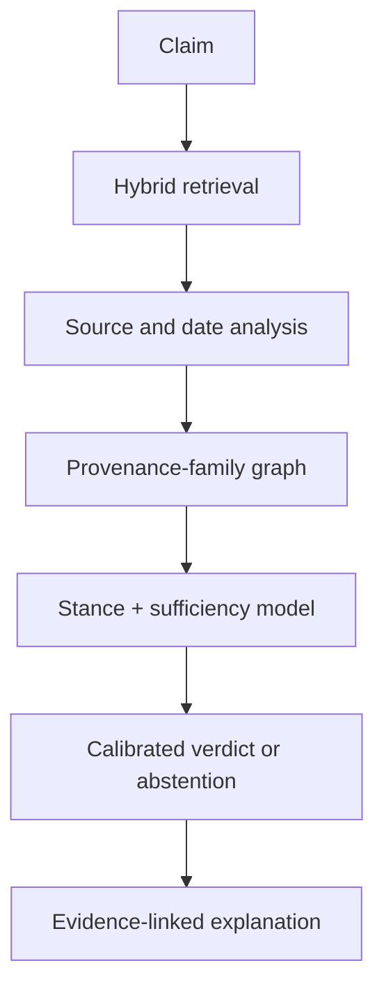

# Project Charter

## Working title

**Repetition Is Not Evidence: Archive- and Provenance-Aware RAG for Verifying the Tesla 3-6-9 Claim and Other Viral Scientific Attributions**

## Problem statement

Conventional retrieval-augmented generation can become overconfident when many search results repeat a claim but ultimately derive from one unsupported page, quotation image, or circular citation. Scientific-attribution claims are a useful stress test because a convincing verdict requires both semantic relevance and provenance: who wrote what, where, and when?

The Tesla “3-6-9” narrative is the motivating case. It offers a clear distinction between:

- a viral quotation attributed to Tesla;
- documented descriptions of Tesla’s habits involving multiples of three; and
- later numerological interpretations.

Treating those statements as equivalent is an evidence error that a provenance-aware AI system should detect.

## Main research question

Can an archive- and provenance-aware retrieval-augmented model verify historical scientific attributions more reliably than standard RAG when repeated web pages create an illusion of independent evidence?

## Subquestions

1. Does collapsing derivative sources into provenance families improve verdict accuracy and calibration?
2. Does explicit evidence-sufficiency prediction reduce unsupported definitive answers?
3. How robust is the system to copied misinformation, fabricated citations, authoritative wording, missing archives, and OCR corruption?
4. Does a system developed around Tesla-related claims generalize to attributions involving other scientists?
5. Which evidence characteristics—source type, date, independence, stance, or textual match—most influence correct abstention?

## Testable hypotheses

- **H1:** APV-RAG will achieve higher macro-F1 and lower expected calibration error than retrieval-only and standard-RAG baselines on provenance-confounded test sets.
- **H2:** Provenance-family collapsing will reduce false support as the number of copied pages increases.
- **H3:** A separate sufficiency head will improve selective accuracy at matched coverage.
- **H4:** Training with provenance and archive perturbations will improve robustness to fabricated citations and OCR degradation.

## Intended contributions

1. **SciAttr-369**, a versioned dataset of scientific-attribution claims with evidence, source type, provenance-family, stance, sufficiency, and verdict labels.
2. **APV-RAG**, a modular verification pipeline that reasons over evidence independence and source chronology.
3. **RIBS** (Repetition-Induced Belief Shift), a stress-test measure quantifying how much a verifier’s confidence changes when semantically redundant copies are added without new evidence.
4. A controlled evaluation suite for copied misinformation, citation fabrication, persuasive phrasing, evidence absence, and OCR noise.
5. An auditable Tesla 3-6-9 case study that separates historical documentation from modern interpretation.

## Proposed model

The initial implementation should remain modular. Each component needs an ablation so the paper can show which contribution produces an improvement.

## Label space

Primary verdict labels:

- `authenticated`: traceable primary or authoritative evidence supports the attribution;
- `misattributed`: evidence supports a different author/origin or shows the attribution arose later;
- `contradicted`: reliable evidence directly conflicts with the claim;
- `insufficient`: available evidence cannot justify a definitive historical verdict.

Evidence-level stance labels:

- `supports`, `refutes`, `mentions_only`, `unrelated`.

The dataset must preserve `insufficient`; it must never be silently converted to `false`.

## Dataset scope

Target for the full paper:

- 500–800 base attribution claims;
- approximately 100 Tesla-focused claims and variants;
- multiple scientists, disciplines, eras, and claim types for generalization;
- 3,000–5,000 total instances after controlled transformations;
- grouped train/development/test splits by canonical claim and provenance family.

The minimum viable study may begin with 150–250 carefully annotated base claims, provided the evaluation is statistically honest and a larger external benchmark is used.

## Baselines

1. lexical retrieval + majority evidence stance;
2. dense retrieval + natural-language-inference verifier;
3. standard RAG with no provenance features;
4. source-quality-weighted RAG without provenance collapsing;
5. APV-RAG without the sufficiency head;
6. full APV-RAG.

Where licenses permit, evaluate transfer or external validity on a public fact-verification benchmark such as AVeriTeC and a scientific-claim/attribution-adjacent corpus selected during the literature review.

## Core evaluation

- macro-F1 and per-class precision/recall;
- evidence retrieval Recall@k and nDCG@k;
- citation precision/recall;
- Brier score and expected calibration error;
- selective accuracy and risk–coverage area;
- RIBS under increasing copy counts;
- paired bootstrap confidence intervals;
- McNemar or permutation tests for paired system comparisons;
- ablations and error taxonomy.

## Leakage controls

- Split by canonical claim, not by wording variant.
- Keep all synthetic paraphrases of one claim in the same split.
- Keep evidence from one provenance family in the same split where appropriate.
- Freeze the corpus snapshot and record access dates.
- Do not use answer-bearing test documents during training.

## Publication positioning

Primary target: **Information Processing & Management**. Plausible alternatives after results are available include **Knowledge-Based Systems** and **Expert Systems with Applications**. Journal selection must be revisited against the completed contribution, current aims and scope, and page/data policies; no acceptance is guaranteed.

## Project stages

| Stage | Deliverable | Exit criterion |
|---|---|---|
| 0. Setup | Reproducible local + Colab environment | Tests and environment checks pass |
| 1. Protocol | Search strategy, ontology, pilot annotation | 20 Tesla records double-checked |
| 2. Dataset | Versioned SciAttr-369 release candidate | Agreement and leakage audit completed |
| 3. Baselines | Reproducible retrieval/verifier results | Baseline table frozen |
| 4. APV-RAG | Provenance graph and dual-head verifier | Ablations run successfully |
| 5. Robustness | Five controlled stress tests | Statistical analysis complete |
| 6. Paper | Manuscript, figures, supplement | Internal reproducibility review passes |

## Stop/go criteria after pilot

Proceed to the full dataset only if the pilot shows:

- the label definitions can be applied consistently;
- source provenance can be recorded without excessive ambiguity;
- a meaningful number of copied-source families exists;
- the test instances are not answerable by trivial keyword matching alone; and
- the planned contribution remains distinct from closely related published work.

